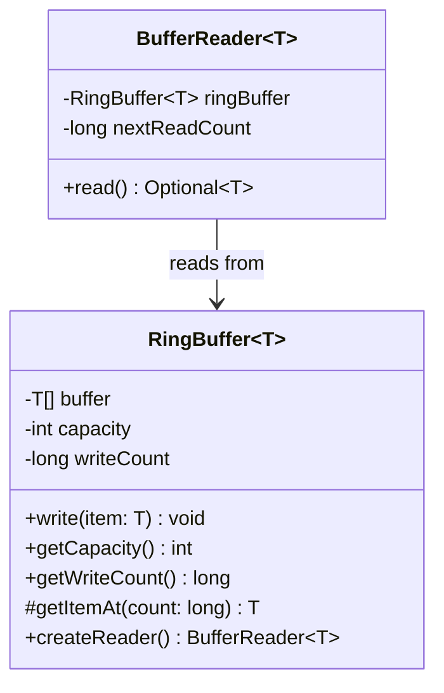
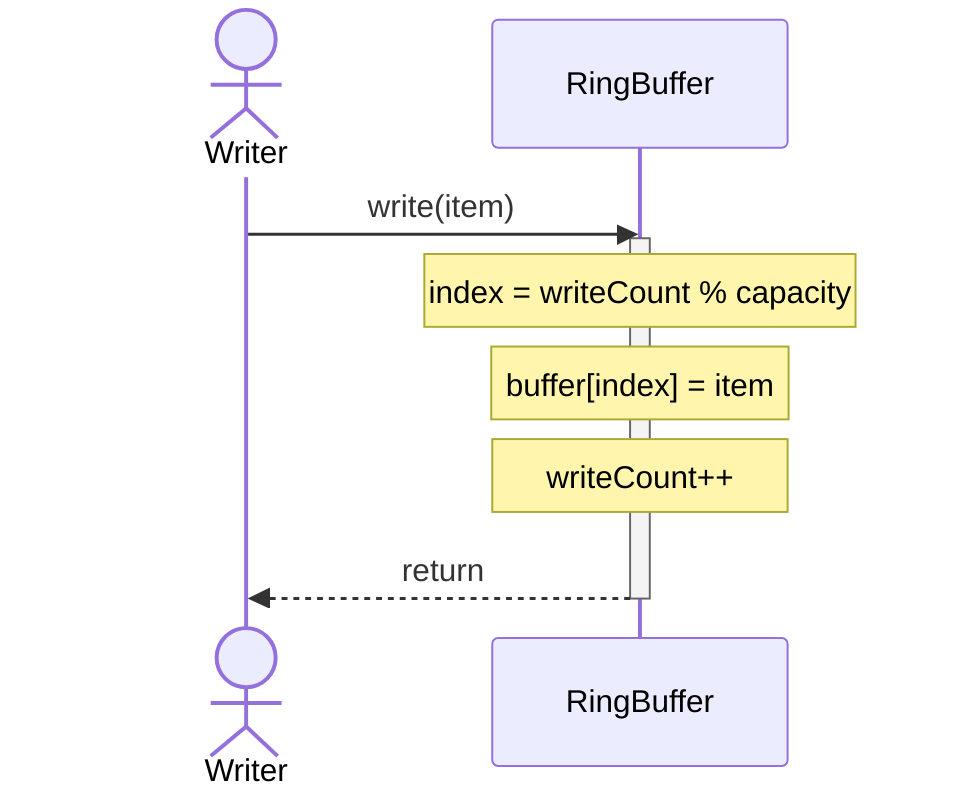
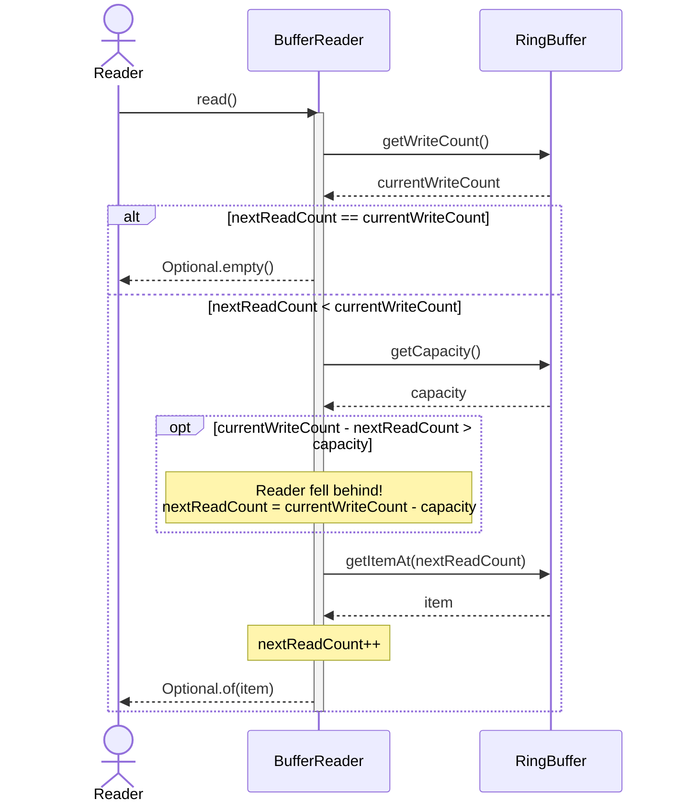

# Multi-Reader Ring Buffer

## Project Overview
This project is a Java-based Ring Buffer (a circular queue) where one "writer" adds data,
and multiple "readers" can read that data independently.

The buffer has a strict size limit. Because each reader keeps track of its own spot in line,
they can all read at different speeds without messing up the process for anyone else.
If the writer adds data too quickly and fills up the buffer, it simply overwrites the oldest items.
If a reader is too slow and misses some data, it's smart enough to realize this.
It will automatically skip ahead to the oldest available item so it can keep reading safely without crashing.

---

## Design Explanation
To keep the code clean and follow good Object-Oriented practices,
I split the work into two main classes instead of cramming everything into one.

### 1. `RingBuffer<T>` (The Storage Container)
* **What it does:** This class holds the actual array of data and keeps track of the total number of items ever written.
* **Its job:** It is the only place where data gets added to the array.
* It provides a `write()` method for the single writer to use, and a `createReader()` method to easily set up new readers.

### 2. `BufferReader<T>` (The Independent Reader)
* **What it does:** This class represents a single reader and keeps track of exactly how many items that specific reader has seen.
* **Its job:** It fetches data from the `RingBuffer`. When `read()` is called,
it checks to see if the main buffer has overwritten older data. If the reader fell behind,
* it safely updates its own counter to catch up and grabs the oldest available data instead.

## UML Diagrams

### Class Diagram

## Sequence Diagram: write()

## Sequence Diagram: read()
